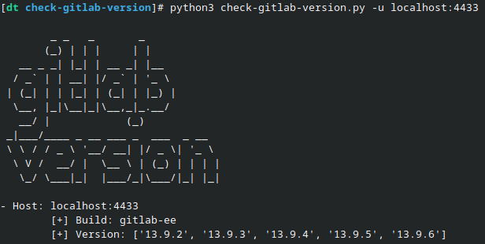

# Check gitlab version

This tool were created for checking gitlab version of the server by comparing the hash from manifest.json with provided list.

## Usage
```
python3 check-gitlab-version.py -u example.com
python3 check-gitlab-version.py -f file.txt
python3 check-gitlab-version.py -t update
```
## Screenshot


## References

